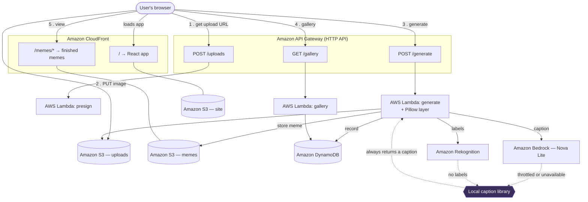

# Weekend Creative Challenge: Meme Alchemist

> **Tag:** `#creative-expression`
>
> _Ready to paste into AWS Builder Center. The live link is filled in; add your
> repo URL at the bottom and drop in screenshots where marked._

---

## Vision & what the app does

I wanted to build something that makes a stranger laugh within ten seconds of
landing on it, with no instructions, no sign-up, and no explanation.

**Meme Alchemist** does one thing: you drop a photo into it, and it hands you
back a meme. Not a template with your photo pasted in — an actual joke *about
your specific photo*. Upload your dog looking guilty on the sofa and you get a
caption about the dog. Upload your desk at 2am and you get a caption about that.

The flow is three steps and takes a few seconds:

1. **It looks at your photo.** Amazon Rekognition returns what it sees — `Dog`,
   `Pet`, `Furniture`, `Living Room`.
2. **It writes a joke.** Those labels go to Amazon Bedrock running Amazon Nova
   Lite, with a prompt asking for a two-line meme caption in the classic setup /
   punchline form.
3. **It stamps the meme.** Pillow overlays the caption in white block capitals
   with a heavy black outline — the look everyone recognises — and the finished
   image lands in S3, ready to download or share.

There's an animated gallery of everything that's been made, a lightbox, and
one-click download and copy-link buttons. The whole thing is a single page.

The design goal I actually cared about, though, wasn't the pipeline. It was
this: **the app must never show a broken state.** More on that below, because it
turned out to matter far more than I expected.

<!--  -->

---

## How I built it

The stack is deliberately small: a React frontend on CloudFront, three Python
Lambdas behind an HTTP API, and Terraform for all of it.

**Uploads bypass the API entirely.** API Gateway caps payloads at 10 MB and
base64 encoding inflates a file by about a third, so an 8 MB photo wouldn't fit.
Instead the browser asks for a presigned S3 URL and PUTs the bytes straight to
the bucket. The `generate` Lambda then works from the object key. This keeps
large images off API Gateway completely and makes the request that does the real
work tiny.

**Pillow ships as a Lambda layer, built without Docker.** `pip` can fetch
prebuilt manylinux wheels for a target platform and interpreter from any host
OS:

```bash
pip install --platform manylinux2014_x86_64 --implementation cp \
            --python-version 3.12 --only-binary=:all: \
            --target build/python Pillow==11.3.0
```

That one command means the build works identically on Windows, macOS and Linux
with no Docker daemon running — which mattered, because on my machine Docker
Desktop was installed but its daemon wasn't up. The build script then *verifies*
that `PIL/*x86_64-linux-gnu.so` actually exists and refuses to continue if not,
so a silently-wrong host build can never reach Lambda.

**The meme font is Anton, not Impact.** Impact is the classic meme typeface but
it's proprietary and can't be redistributed inside a deployment package. Anton
is SIL Open Font Licensed and has nearly identical presence.

### The part I'd build this way again: designing for failure first

Here's where the weekend got interesting.

Early in the build, my first real call to Bedrock came back:

```
ThrottlingException: Too many tokens per day, please wait before trying again.
```

My account had hit its **daily token quota** — across Nova Lite, Micro *and*
Pro. Not a permissions problem (that returns `AccessDeniedException`); a quota
that resets on a rolling 24-hour basis. If the entire app had hung off a
single Bedrock call, my demo would have been a spinner and an error toast.

So captioning has two tiers, and the function that owns it makes one promise:
**it never raises because of a Bedrock problem.**

If Bedrock is throttled, denied, slow, or returns something unparseable, the app
falls back to a local caption library keyed on the Rekognition labels — 13
themes (dog, cat, food, office, person, outdoors, vehicle, drink, and so on),
each with hand-written captions. Because it's keyed on the labels, the fallback
joke still responds to *your* photo rather than reading like a generic error. If
there are labels but no theme matches, the top label gets interpolated into a
template. If Rekognition found nothing at all, you get a self-aware "the AI
looked at this and quietly gave up" caption.

Selection is seeded with the meme's UUID, so the same image always produces the
same joke instead of changing on every retry.

Every fallback logs a structured `fallback_used` event with the reason, so it's
visible in CloudWatch rather than silently hiding a problem. And the API reports
`captionSource: "bedrock" | "fallback"` so the UI can be honest about it.

The result: for a good chunk of this build, **the fallback path *was* the live
path, and the app kept working.** When the quota resets it switches back to
Bedrock automatically — no redeploy, no config change.

I wrote tests for exactly this. The suite simulates a Bedrock throttle, a
Rekognition outage, and both failing simultaneously, and asserts each time that
a valid, downloadable meme still comes back. That's 107 tests in total — 72
backend, 35 frontend.

The other thing I'd repeat: a **preflight script** that runs before Terraform
touches anything. It checks credentials, that the region offers Nova, and — the
one that actually catches people — whether model access is *enabled*, by making
a real `InvokeModel` call. Listing a model doesn't mean you can invoke it. If
access isn't enabled it prints the exact console URL and steps. Notably, it
treats a throttle and an access denial differently: the first is a warning that
says deployment is safe, the second is a blocking failure.

---

## AWS services used & architecture overview



**Every AWS service used, and what it does:**

- **Amazon S3** — three private buckets: raw uploads (auto-expiring after seven
  days), finished memes, and the built React app.
- **AWS Lambda** — three Python 3.12 functions: `presign` issues upload URLs,
  `generate` runs the whole pipeline, `gallery` lists recent memes.
- **Amazon API Gateway** — an HTTP API exposing those three routes, with CORS
  and a 10 req/s throttle so a stray script can't run up a bill.
- **Amazon Rekognition** — `DetectLabels` identifies what's actually in the
  photo; this is what makes the joke about *your* image.
- **Amazon Bedrock (Amazon Nova Lite)** — turns those labels into a two-line
  meme caption, with retries and exponential backoff.
- **Amazon DynamoDB** — one table recording every meme, with a
  constant-partition GSI so the gallery reads newest-first via a Query rather
  than a Scan.
- **Amazon CloudFront** — a single distribution serving both the app and the
  memes from private buckets through Origin Access Control, so no bucket is ever
  public and image URLs are same-origin (no CORS on download or share).
- **Amazon CloudWatch Logs** — structured JSON logs with request ids, including
  the `fallback_used` event.
- **AWS IAM** — one least-privilege role per Lambda; `presign` can only write
  under `uploads/`, `gallery` can only query the table.

---

## What I learned

**A managed model is a dependency, and dependencies fail.** I'd internalised
this for databases and never really applied it to an LLM call. Hitting a daily
token quota on day one turned an abstract "add a fallback" task into the thing
that saved the project. Designing the degraded path *first* — and deciding that
a slightly less clever joke always beats an error screen — made every later
decision easier.

**Degrade, don't fail — but be honest about it.** The temptation is to hide the
fallback so the app looks smarter. Returning `captionSource` and showing a small
note when the library wrote the caption costs nothing and makes the system
debuggable. A silent fallback is a bug you'll find months later.

**"Enabled" and "invokable" are different things.** `ListFoundationModels`
happily lists models your account cannot call. Only a real `InvokeModel` tells
you the truth, and distinguishing `AccessDeniedException` from
`ThrottlingException` is the difference between "stop, go fix this in the
console" and "carry on, the app handles it."

**Cross-platform shell scripts punish assumptions.** Two bugs I hit were
Windows-specific and both were mine: the AWS CLI is a native Windows binary that
can't read a Git Bash `/tmp` path, and `grep -q` inside a pipeline with
`set -o pipefail` reports a *successful* match as a failure, because grep
short-circuits and the writer dies of SIGPIPE. My preflight script confidently
told me Nova wasn't available in us-east-1. It was.

**Rekognition's vocabulary is what makes the fallback feel intelligent.** Its
labels are broad and predictable — real photos reliably produce `Dog`, `Person`,
`Food`, `Computer`. That predictability is exactly what let a static caption
library still feel responsive to the image in front of it.

---

## Link to the app

**Live app:** https://d2ruu5tx6ircv8.cloudfront.net

**Source:** <!-- PASTE YOUR REPO URL HERE -->

Everything is Terraform. `./scripts/preflight-check.sh` verifies your account
can run it, `./scripts/bootstrap.sh` creates the state bucket, `./scripts/deploy.sh`
stands the whole thing up, and `./scripts/destroy.sh` takes it back to zero cost.

Go make something silly with it. 🧪
