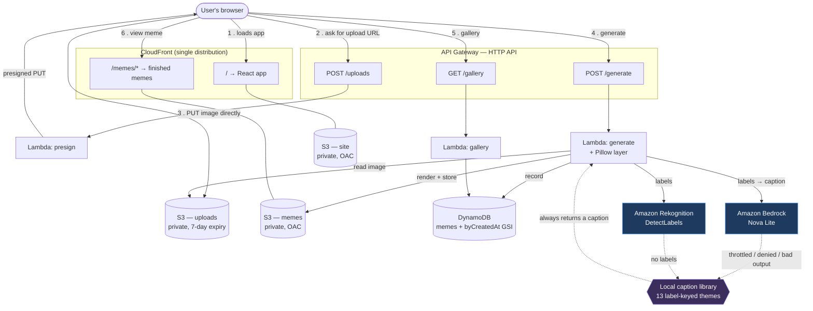
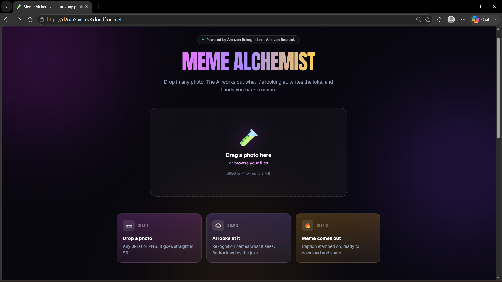
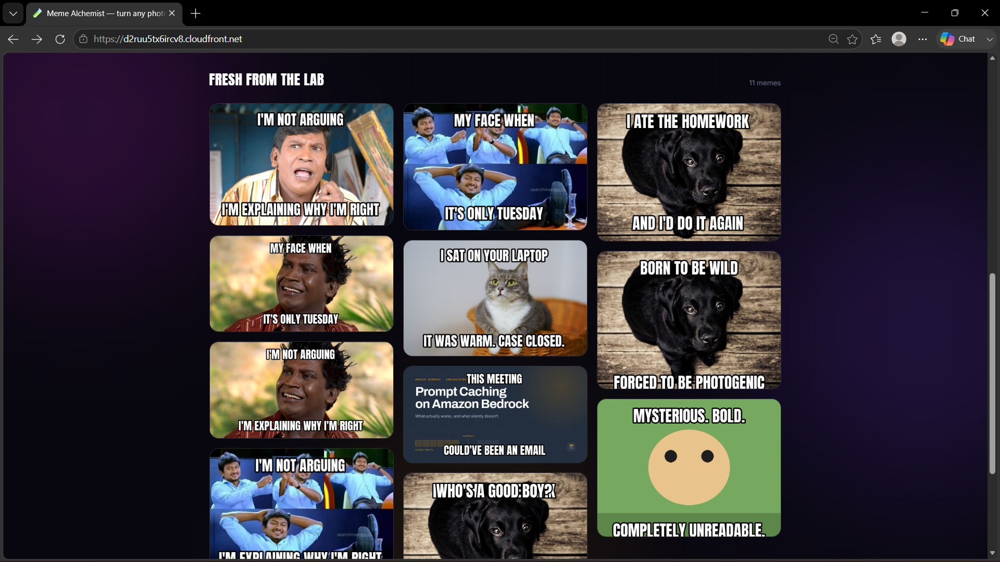

# 🧪 Meme Alchemist


> **Two paths, one promise.** When Amazon Bedrock answers, you get a freshly
> written AI caption. When it's throttled, denied or slow, the local caption
> library takes over and you still get a meme. The user never sees the
> difference — and never sees an error.

Upload a photo. **Amazon Rekognition** works out what's in it, **Amazon Bedrock
(Nova)** writes a joke about it, **Pillow** stamps that joke on the image in
classic meme lettering, and you get a shareable meme back in a few seconds.

Built for the AWS Weekend Creative Challenge.

**Live app:** https://d2ruu5tx6ircv8.cloudfront.net

---


> **The whole system in one picture.** Six numbered steps follow a single
> request from the browser to a finished meme. The dashed box on the right is
> where the reliability lives: Rekognition and Bedrock are the standard AI
> path, and the moment either is throttled, denied or returns something
> unusable, the local caption library answers instead — so `Lambda generate`
> always has a caption to render.

---

## What makes it interesting

The pipeline is the easy part. The interesting part is that **it cannot show a
broken state**.

Bedrock can be throttled, denied, slow, or return something unparseable.
Rekognition can find nothing in a photo. In every one of those cases the app
still returns a real, downloadable meme — because captioning falls back to a
label-keyed local joke library and reports which path it used.

This is not hypothetical. The AWS account this was built on **hit its daily
Bedrock token quota during development**, so the fallback path was the live path
for much of the build. The app kept working. When the quota resets it switches
back to Bedrock automatically, with no redeploy.

---

## Architecture



### AWS services and what each one does

| Service | Role in this app |
|---|---|
| **Amazon S3** | Three private buckets: raw uploads (auto-expiring after 7 days), finished memes, and the built React app. |
| **AWS Lambda** | Three Python 3.12 functions — `presign` issues upload URLs, `generate` runs the whole meme pipeline, `gallery` lists recent memes. |
| **Amazon API Gateway** | HTTP API exposing the three routes, with CORS and a 10 req/s throttle so a stray script can't run up a bill. |
| **Amazon Rekognition** | `DetectLabels` identifies what's actually in the photo — this is what makes the joke about *your* image. |
| **Amazon Bedrock (Nova Lite)** | Turns those labels into a two-line meme caption, with retries and backoff. |
| **Amazon DynamoDB** | One table recording every meme; a constant-partition GSI lets the gallery read newest-first without a scan. |
| **Amazon CloudFront** | One distribution serving both the app and the memes from private buckets via Origin Access Control. |
| **Amazon CloudWatch Logs** | Structured JSON logs with request ids, including a `fallback_used` event whenever Bedrock is bypassed. |
| **AWS IAM** | One least-privilege role per Lambda — `presign` can only write under `uploads/`, `gallery` can only query the table. |

---

## Repository layout

```
backend/
  src/
    common/          config, structured logging, HTTP helpers
    presign/         POST /uploads
    generate/        POST /generate — pipeline, captions, Pillow rendering
      assets/        Anton-Regular.ttf (SIL OFL)
    gallery/         GET /gallery
  layer/             Pillow layer build (no Docker required)
  tests/             72 pytest tests
frontend/
  src/
    components/      UploadZone, StageLoader, MemeReveal, Gallery, Lightbox…
    api.js           the three API calls + client-side validation
    test/            35 Vitest / Testing Library tests
infra/               Terraform: S3, Lambda, API Gateway, DynamoDB, CloudFront, IAM
scripts/             preflight-check, bootstrap, deploy, e2e-test, test-all, destroy
```

---

## Prerequisites

- An AWS account with **Bedrock model access enabled** for Amazon Nova
  (`preflight-check.sh` checks this and prints exact console steps if not)
- AWS CLI v2, configured (`aws configure`)
- Terraform ≥ 1.9
- Python 3.12 and Node.js 18+

Docker is **not** required.

---

## Deploy

```bash
# 1. Verify everything before touching AWS
./scripts/preflight-check.sh

# 2. One-time: create the Terraform state bucket
./scripts/bootstrap.sh

# 3. Build and deploy everything
./scripts/deploy.sh

# 4. Prove the live app works
./scripts/e2e-test.sh
```

`deploy.sh` builds the Pillow layer, applies Terraform, smoke-tests the API
*before* building the frontend against it, builds the React app with the real
API URL baked in, syncs it to S3, and invalidates CloudFront. It is safe to
re-run.

### Teardown

```bash
./scripts/destroy.sh          # prompts for confirmation
FORCE=1 ./scripts/destroy.sh  # no prompt
```

The Terraform state bucket is intentionally left behind; delete it by hand if
you want it gone.

---

## Tests

```bash
./scripts/test-all.sh
```

Runs backend pytest (with moto mocking S3, DynamoDB and Rekognition), frontend
Vitest, `terraform fmt -check`, `terraform validate`, and a `terraform plan`
sanity check.

**115 tests total — 80 backend, 35 frontend.**

The backend suite covers the happy path, invalid and oversized file rejection,
corrupt images, and — most importantly — the fallback path: it simulates a
Bedrock `ThrottlingException`, a Rekognition outage, and both failing at once,
asserting each time that a valid meme still comes back.

---

## Cost

Everything used here is either free-tier eligible or fractions of a cent at demo
volume.

| Service | Notes |
|---|---|
| Lambda | ~2–4s of 1536 MB execution per meme |
| Rekognition | First 5,000 images/month free for 12 months |
| Bedrock Nova Lite | Cheapest Nova tier; a caption is a few hundred tokens |
| S3 | Uploads expire after 7 days; memes are ~150 KB each |
| DynamoDB | On-demand; one small write and one query per meme |
| CloudFront | `PriceClass_100`; the main idle cost, still pennies/month |
| CloudWatch | 14-day retention |

Roughly **a few cents for a weekend of demoing**. `destroy.sh` takes it to zero.

---

## Screenshots

The hero banner and architecture diagram are at the top of this file.

### Landing view

The drop zone, and the three-step explainer that tells you what the app does
before you read a word of copy.



### Gallery

Every meme brewed so far, in an animated masonry wall. These are real captions
on real uploads — and every one of them was written by the local fallback
library while the account's Bedrock quota was exhausted, which is exactly the
point.



### Still to capture

<!--  — the staged loader mid-request -->
<!--  — the reveal, with detected labels -->

The staged loader and the single-meme reveal. Drop `loading.png` and `meme.png`
into `screenshots/` and uncomment the two lines above.

---

## Further reading

- [`DECISIONS.md`](DECISIONS.md) — every non-obvious choice and why
- [`API.md`](API.md) — full endpoint reference with error codes
- [`ARTICLE_DRAFT.md`](ARTICLE_DRAFT.md) — the Builder Center submission

## Credits

Meme lettering set in [Anton](https://fonts.google.com/specimen/Anton), SIL Open
Font License.
